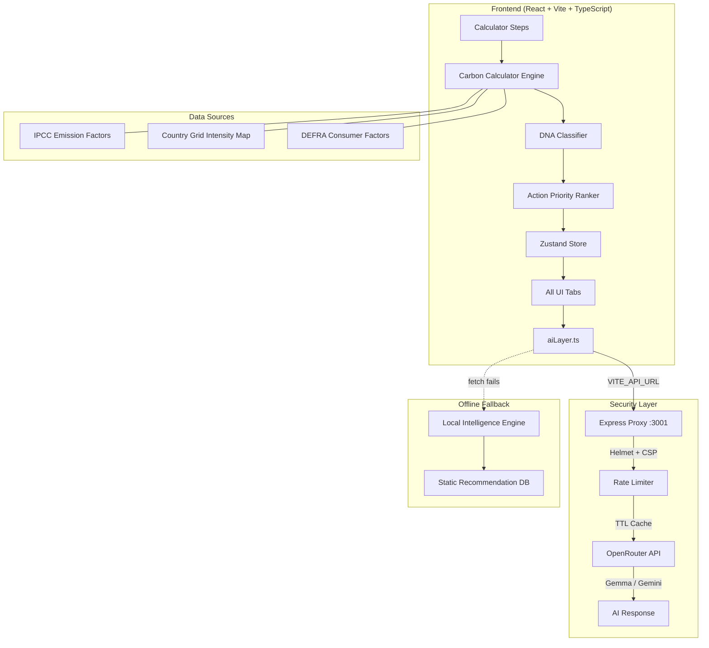

<div align="center">


# 🌿 CarbonSense

### AI-Powered Personal Carbon Footprint Intelligence Platform

[](https://hack2skill.com)
[](https://reactjs.org/)
[](https://typescriptlang.org/)
[](https://vitejs.dev/)
[](https://nodejs.org/)
[](LICENSE)
[](src/__tests__)

> **CarbonSense** is a full-stack AI sustainability platform that calculates your personal carbon footprint, classifies your unique "Carbon DNA" persona, and delivers hyper-personalized recommendations — all powered by a secure backend AI proxy and built for offline-first resilience.

[**Live Demo**](#) · [**Architecture**](#architecture) · [**Getting Started**](#getting-started) · [**Features**](#features)

</div>

---

## ✨ Features

### 👤 My Profile — Your Carbon Identity

**4-Step Guided Calculator** using IPCC-based emission factors:

| Step | What It Measures |
|------|-----------------|
| ⚡ Energy | Monthly kWh, AC usage, gas heating, electricity source (grid/solar/mixed), country-specific grid intensity |
| 🚗 Transport | Primary vehicle (petrol/diesel/EV/walk/bus/metro/two-wheeler), weekly km, public-transit km — calculated as two additive inputs, not a single choice |
| 🥗 Diet | Dietary pattern, meat frequency, dairy consumption |
| 🛍️ Lifestyle | Shopping habits, consumption patterns, waste behaviour |

**Carbon DNA Persona Classification** — after calculation, you're classified into one of five scientifically-grounded personas:

- 🌟 **Eco-Leader** — well below average across all categories
- ⚖️ **Balanced Emitter** — moderate footprint, spread across categories
- 🏙️ **Urban Commuter** — transport-dominant footprint
- ⚡ **Energy-Intensive Resident** — energy usage is the primary driver
- 🏭 **Industrial Consumer** — high consumption/shopping-driven footprint

Each persona gets a **category breakdown** (energy/transport/diet/consumption percentages), a **trend indicator**, a **top priority action**, and a **Carbon Evolution panel** showing a 5-year projection comparing your business-as-usual trajectory against an achievable sustainable-action path.

**ELI10 Mode** — one toggle simplifies all technical language and jargon app-wide to plain, accessible explanations suitable for anyone.

---

### 🧠 Intelligence — Understand Your Impact

**Sustainability Scorecard** — a 0–100 composite score with category-level breakdowns, "Top Strength" and "Biggest Opportunity" callouts, and a full emissions table.

**What-If Simulator** — three live sliders (Drive Less / Fly Less / Reduce Meat & Dairy) that recompute your projected annual footprint and potential savings *as you drag*, with no page reload required.

**Benchmark Comparison** — visual chart comparing your footprint against:
- 🇮🇳 India national average (2t CO₂e)
- 🌍 Global average (4.7t CO₂e)
- 🏆 Top 10% of lowest emitters (1.3t CO₂e)
- 🎯 Paris Agreement 2030 per-capita target (2t CO₂e)

**Progress Tracker** — shows your monthly carbon budget vs. actual emissions against a sustainable 167 kg/month target, with an actionable gap message.

---

### ✅ Actions — Personalised Roadmap

**Phase-Based Action Roadmap** across four stages:
- **Phase 1: Quick Wins** — easy, immediate, high-impact actions
- **Phase 2: Habit Formation** — weekly behaviour changes
- **Phase 3: Optimisation** — systemic home/transport upgrades
- **Phase 4: Carbon Neutral** — deep decarbonisation moves

Each action is **persona-personalised** — the `reason` text and ranking are dynamically adjusted based on your Carbon DNA, so an Energy-Intensive Resident sees energy actions promoted to P0 while an Urban Commuter sees transit actions surfaced first. Completed-category actions automatically promote remaining actions in that category tier.

Track progress with **eco-points and levels** (Beginner → Expert), and click **✨ AI Guide** on any action to get an AI-generated step-by-step implementation plan.

**AI Sustainability Advisor Chat** — a conversational AI coach with three selectable personas:
| Persona | Style |
|---------|-------|
| 💚 Friendly Guide | Supportive, encouraging, motivational |
| 💪 Strict Coach | Direct, results-focused, no excuses |
| 🔬 Eco Scientist | Data-driven, citations, precise numbers |

Pre-loaded with contextual quick-questions based on your actual footprint data. Falls back gracefully to a local intelligence engine if the AI backend is unreachable.

---

### 📊 Reports & Settings

**Carbon Identity Report** — a downloadable PDF of your full profile: DNA persona, annual footprint, category breakdown, P0 priority actions, achievement badges, and a comparison against the India average.

**Achievement Badges** — 7 unlockable milestones from First Step to Net Zero Path, tracked via persistent local habit state.

**Carbon Offsetting Calculator** — calculates how many mature trees per year are needed to offset your unavoidable emissions, plus an estimated cost via certified offset programs. Includes a clear disclaimer that offsets are a last resort, not a substitute for reducing direct emissions.

**Settings Panel:**
- 🌙/☀️ Dark/Light theme toggle
- 🧒 ELI10 mode toggle
- 🌐 Google Translate widget (100+ languages)
- 🤖 AI Coach Persona selection
- 🔒 System Health audit (live backend ping, CSP check, input validation status, error boundary status)
- 🗑️ Clear All Data

---

### 🧪 Eco Lab — Explore & Discover

**AI Receipt & Meal Scanner** — upload a photo of a shopping receipt or a meal; Vision AI extracts line items and returns per-item carbon footprint estimates.

**Daily Eco-Challenge** — AI-generated sustainability trivia, refreshed daily to build engagement and eco-awareness habits.

**Impact Comparison Tool** — compare the cradle-to-gate carbon footprint of common products (beef vs. chicken vs. lentils, laptop vs. smartphone, cotton jeans vs. t-shirt) to inform purchasing decisions.

**Digital Footprint Calculator** — estimate the CO₂e impact of your digital habits: video streaming hours, daily AI query volume, cloud storage usage.

---

### 🌍 Lifestyle — AI-Powered Sustainability Coaching

**AI Recipe Wizard** — list your fridge leftovers; the AI returns a low-carbon recipe using those exact ingredients, with per-serving emission estimates.

**Eco-Travel Router** — enter origin and destination; the AI suggests the lowest-carbon route and compares transport mode emissions side by side.

---

## 🏗️ Architecture



**Stack at a glance:**

| Layer | Technology |
|-------|-----------|
| Frontend | React 18, TypeScript, Vite, Tailwind CSS, Framer Motion |
| State | Zustand with persist middleware |
| Backend proxy | Express.js, Helmet, express-rate-limit |
| AI provider | OpenRouter (Gemma 3 / Gemini) |
| Testing | Vitest, React Testing Library |
| Emission data | IPCC AR6, DEFRA 2023, IEA Grid Intensity |

---

## 🔒 Security Posture

- **API key never touches the client** — all AI calls are proxied through the Express backend; the `OPENROUTER_API_KEY` lives only in a server-side `.env` file
- **Helmet** sets secure HTTP headers on every response (X-Frame-Options, X-Content-Type-Options, HSTS, Referrer-Policy)
- **Content Security Policy** — strict allowlist restricting script/style/image/connect sources
- **Rate limiting** — 100 requests per 15 minutes per IP on the `/api/chat` endpoint
- **CORS** — origin allowlist driven by `ALLOWED_ORIGINS` environment variable; defaults to localhost in dev
- **TTL response cache** — identical prompts served from memory for 1 hour, reducing API cost and latency
- **Input validation & sanitisation** — `sanitizeText()` strips HTML/script tags from all user inputs; `validateInputs()` enforces type and range constraints before any calculation
- **No SQL** — no database, no SQL injection surface; all state is in-memory or client-side
- **XSS** — React's default JSX escaping + `sanitizeText()` for externally-supplied strings; no `dangerouslySetInnerHTML` anywhere in application code

---

## 📊 Data & Methodology

CarbonSense uses the following emission factor sources:

| Category | Source |
|----------|--------|
| Electricity (grid) | IEA 2023 country-level grid intensity (kg CO₂e/kWh) |
| Transport | IPCC AR6 WGIII — vehicle lifecycle emission factors |
| Food/Diet | DEFRA 2023 GHG conversion factors for food categories |
| Consumer goods | DEFRA 2023 spend-based emission factors |
| AC & gas | IPCC-aligned appliance energy intensity estimates |

The calculator runs **entirely client-side / offline-first** for the base footprint number — no data is sent anywhere until a user explicitly triggers an AI feature. All AI features fall back gracefully to a local static-logic engine if the backend is unreachable or times out.

---

## 🚀 Getting Started

### Prerequisites
- Node.js ≥ 18
- An [OpenRouter](https://openrouter.ai) API key

### 1. Clone & install

```bash
git clone https://github.com/Siva-2511/Carbonfootprint.git
cd Carbonfootprint
npm install
```

### 2. Configure environment

```bash
# Root .env
cp .env.example .env
# Set VITE_API_URL=http://localhost:3001/api/chat

# Server .env
cp server/.env.example server/.env
# Set OPENROUTER_API_KEY=your_key_here
# Set ALLOWED_ORIGINS=http://localhost:5173
```

### 3. Run (two terminals required)

```bash
# Terminal 1 — Frontend
npm run dev

# Terminal 2 — Backend proxy
cd server && npm start
```

Open [http://localhost:5173](http://localhost:5173)

### 4. Run tests

```bash
npx vitest run        # 54 unit + component tests
npx tsc --noEmit      # TypeScript type check
npx eslint .          # Lint (0 errors)
```

---

## ⚠️ Known Limitations

- **AI features require the backend proxy running** — if `cd server && npm start` isn't running, all AI-powered features (chat advisor, recipe wizard, travel router, receipt scanner, daily challenge, action AI guides) automatically fall back to the local static intelligence engine. The core carbon calculator and all analytics work fully offline.
- **Receipt Scanner accuracy** — Vision AI extraction quality depends on image clarity and lighting; handwritten receipts may produce lower accuracy.
- **Emission factors are estimates** — individual lifestyle variation means actual emissions may differ from calculated values. The tool is best used for *relative comparison* and *identifying the highest-leverage changes*, not as a precise audit.
- **Grid intensity defaults to "Global Average"** if no country is selected — users in India should select "India" for more accurate electricity emission calculations.

---

## 🧪 Testing

```
src/__tests__/
├── calculator.test.ts       # Core emission calculation logic
├── dnaClassifier.test.ts    # Persona classification
├── actionPriority.test.ts   # Recommendation ranking + DNA personalisation
├── projectionEngine.test.ts # 5-year BAU vs sustainable projections
├── validation.test.ts       # Input sanitisation, clamp, boundary cases
└── security.test.ts         # XSS simulation, audit function behaviour
```

54 tests passing · 0 failures · Clean TypeScript build · 0 ESLint errors

---

## 🤝 Contributing

This project was built for the **Hack2Skill & Google for Developers AI Challenge 2026**. Pull requests are welcome for bug fixes and improvements.

---

<div align="center">

Built with ❤️ for the **Hack2Skill & Google for Developers AI Challenge 2026**

Developed by **Sivasubramaniyan G**

*CarbonSense — because the planet needs intelligence, not just intention.*

</div>
