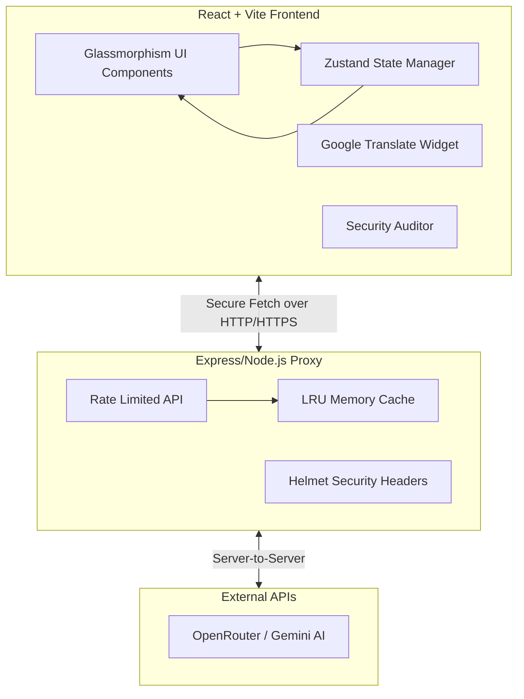

# CarbonSense 🌍

Welcome to **CarbonSense**! This is a highly developed, premium SaaS-style sustainability dashboard and carbon footprint calculator designed to help users track, understand, and reduce their environmental impact with the help of AI.

Built with ❤️ for the Hack2Skill & Google for Developers AI Challenge 2026. Developed by Sivasubramaniyan G.

## Features ✨

**My Profile tab**: 4-step guided calculator (Energy, Transport, Diet, Lifestyle/consumption) using IPCC-based emission factors, with country-aware electricity grid intensity, household size scaling, and real-time input validation. Produces a "Carbon DNA" result: a persona classification (e.g. Eco-Leader, Balanced Emitter, Urban Commuter) with a category breakdown (energy/transport/diet/consumption percentages), a trend indicator, and a "Carbon Evolution" panel showing a 5-year projected trajectory comparing business-as-usual emissions against an achievable sustainable-action trajectory.

**Intelligence tab**: A Sustainability Scorecard (0-100 score with category-level breakdown and a "biggest opportunity" callout), a What-If Simulator with live sliders (Drive Less / Fly Less / Reduce Meat & Dairy) that recompute projected footprint and savings in real time, a benchmark comparison chart against India average, global average, top-10%-of-emitters, and the Paris Agreement 2030 per-capita target, and a Progress Tracker showing monthly carbon budget vs. actual emissions.

**Actions tab**: A phase-based Action Roadmap (Quick Wins / Habit Formation / Optimization / Carbon Neutral) with priority-ranked, persona-personalized recommendations, checkable progress tracking with eco-points and levels, an AI-generated step-by-step guide per action, and an AI Advisor chat with three selectable coaching personas (Friendly Guide, Strict Coach, Eco Scientist).

**Reports & Settings tab**: An Identity Report summary, a Carbon Offsetting calculator (tree-equivalent estimate), theme toggle, ELI10 mode (simplifies technical language app-wide), AI coach persona selection, and a System Health panel showing live security audit results.

**Eco Lab tab**: An AI Receipt & Meal Scanner (upload a photo, get itemized carbon footprint estimates via Vision AI) and a Daily Eco-Challenge (AI-generated sustainability trivia).

**Lifestyle tab**: An AI Recipe Wizard (turns listed ingredients into a low-carbon recipe suggestion) and an Eco-Travel Router (suggests the lowest-carbon route between two locations).

**Cross-cutting**: Offline-first local fallback for every AI feature (the app remains fully functional with static/local logic if the AI backend is unreachable or times out), Google Translate-powered multi-language support, full keyboard navigation and ARIA labeling across all six tabs, and a backend security posture (Helmet, CSP, rate limiting, CORS allowlisting, response caching) that keeps the AI provider key server-side only.

### Known Limitations
If the AI backend proxy is unreachable or times out, the AI-dependent features gracefully degrade to local logic and static fallbacks, ensuring the application remains functional without disrupting the core user experience.

## Architecture Diagram 🏗️



## Getting Started 🚀

To run this application locally, you will need two terminal windows (one for the frontend, one for the backend proxy).

### 1. Environment Setup

In the `server` directory, create a `.env` file:
```env
OPENROUTER_API_KEY=your_api_key_here
PORT=3001
VITE_ALLOWED_ORIGINS=http://localhost:5173,http://127.0.0.1:5173
```

In the root directory, create a `.env` file:
```env
VITE_API_URL=http://localhost:3001/api/chat
```

### 2. Install Dependencies

Install dependencies for both the frontend and the backend:

```bash
# In the root directory
npm install

# In the server directory
cd server
npm install
```

### 3. Run the Application

Start both the backend proxy and the frontend Vite server. You can use the root-level script to run both concurrently if your environment supports it, or run them in separate terminals:

**Terminal 1 (Backend):**
```bash
cd server
npm start
```

**Terminal 2 (Frontend):**
```bash
npm run dev
```

The app will be available at `http://localhost:5173`.

## Methodology & Data

CarbonSense calculates your baseline emissions using general IPCC-style emission factors (e.g., specific CO2e/km for different vehicle types, CO2e/kWh for grid electricity, and dietary averages). 

The AI layer is then used to *enhance* these calculations—for example, by looking at an image of a receipt and using Vision AI to identify specific products to calculate their individual carbon footprint, or by acting as a conversational coach to provide highly personalized advice based on your baseline "Carbon DNA".
