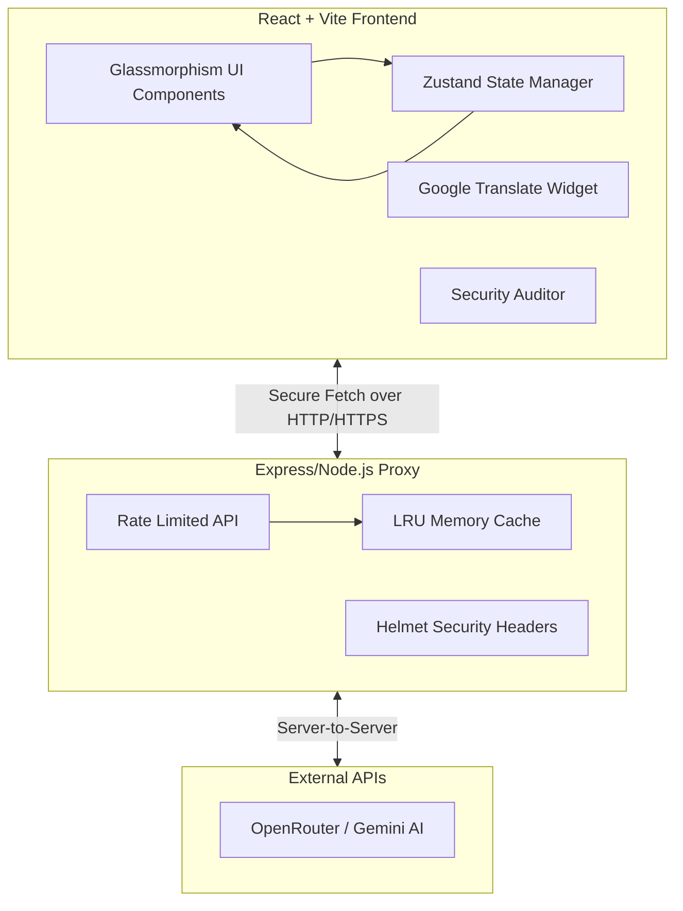

# CarbonSense 🌍

Welcome to **CarbonSense**! This is a highly developed, premium SaaS-style sustainability dashboard and carbon footprint calculator designed to help users track, understand, and reduce their environmental impact with the help of AI.

Built with ❤️ for the Hack2Skill & Google for Developers AI Challenge 2026. Developed by Sivasubramaniyan G.

## Features ✨

- **Premium SaaS UI**: Glassmorphism cards, animated gradients, magnetic buttons, and smooth scroll-triggered micro-interactions using Framer Motion.
- **IPCC-Based Carbon Calculator**: A detailed 4-category calculator using standard emission factors before AI enhancement.
- **Carbon DNA & Personas**: Classifies users into Carbon DNA archetypes and provides AI coaching from distinct personas.
- **AI-Powered Insights**: Securely proxied Google Gemini/OpenRouter AI generates daily sustainability challenges, analyzes receipt/meal images for carbon impact, and provides a conversational advisor.
- **Strict Security & Hardening**:
  - **Content Security Policy (CSP)** to prevent XSS.
  - **Helmet** integration for HTTP header security.
  - **Rate Limiting** to prevent DDoS on the proxy.
  - Server-side environment variables (`.env`) for keeping API keys secure—**no keys are exposed to the client**.
- **Performance Optimized**: Built with React and Vite. The Express backend uses a bounded LRU cache to minimize redundant AI API calls.
- **Built for Accessibility**: Full ARIA support (`aria-label`, `aria-hidden`, keyboard navigation), high-contrast text, semantic HTML5 tags, and accessible tab interfaces.
- **Global Translation**: Multi-language support powered by Google Translate.

## Architecture Diagram 🏗️



## Getting Started 🚀

To run this application locally, you will need two terminal windows (one for the frontend, one for the backend proxy).

### 1. Environment Setup

In the `server` directory, create a `.env` file:
```env
OPENROUTER_API_KEY=your_api_key_here
PORT=3001
VITE_ALLOWED_ORIGINS=http://localhost:5173,http://127.0.0.1:5173
```

In the root directory, create a `.env` file:
```env
VITE_API_URL=http://localhost:3001/api/chat
```

### 2. Install Dependencies

Install dependencies for both the frontend and the backend:

```bash
# In the root directory
npm install

# In the server directory
cd server
npm install
```

### 3. Run the Application

Start both the backend proxy and the frontend Vite server. You can use the root-level script to run both concurrently if your environment supports it, or run them in separate terminals:

**Terminal 1 (Backend):**
```bash
cd server
npm start
```

**Terminal 2 (Frontend):**
```bash
npm run dev
```

The app will be available at `http://localhost:5173`.

## Methodology & Data

CarbonSense calculates your baseline emissions using general IPCC-style emission factors (e.g., specific CO2e/km for different vehicle types, CO2e/kWh for grid electricity, and dietary averages). 

The AI layer is then used to *enhance* these calculations—for example, by looking at an image of a receipt and using Vision AI to identify specific products to calculate their individual carbon footprint, or by acting as a conversational coach to provide highly personalized advice based on your baseline "Carbon DNA".
