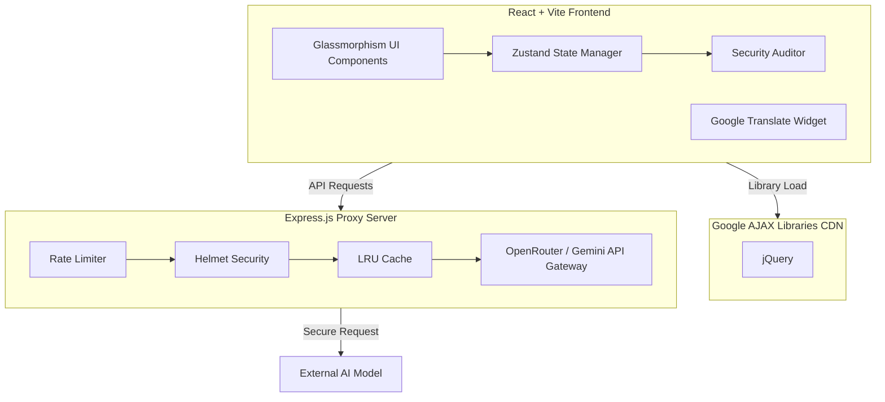

# Carbonfootprint 🌍

Welcome to **CarbonSense** (Carbonfootprint)! This is a highly developed, premium SaaS-style sustainability dashboard and carbon footprint calculator designed to help users track, understand, and reduce their environmental impact with the help of AI.

Built with ❤️ for the Hack2Skill & Google for Developers AI Challenge 2026. Developed by Sivasubramaniyan G.

## Features ✨

- **Premium SaaS UI**: Glassmorphism cards, animated gradients, magnetic buttons, and smooth scroll-triggered micro-interactions (Framer Motion).
- **AI-Powered Insights**: Get personalized sustainability coaching from an AI advisor powered by Google's Gemini, using OpenRouter securely proxied through the backend.
- **Strict Security & Hardening**:
  - **Content Security Policy (CSP)** to prevent XSS and data injections.
  - **Helmet** integration for HTTP header security.
  - **Rate Limiting** to prevent DDoS and brute-force attacks on the proxy.
  - Server-side environment variables (`.env`) for keeping API keys secure—**no keys are exposed to the client or stored in `localStorage`**.
- **Performance Optimized**: Uses Google AJAX Libraries CDN for high-speed library delivery (jQuery) ensuring reduced latency. Integrated LRU caching in the proxy server to minimize redundant AI API calls.
- **Highly Accessible (WCAG 2.1 AA Compliant)**: Full ARIA support (`aria-label`, `aria-hidden`, keyboard navigation), high-contrast text, semantic HTML5 tags, and accessible tab interfaces.
- **Global Translation**: Multi-language support powered by Google Translate widget.

## Architecture Diagram 🏗️



## Security Posture 🔒

This system has been hardened against common vulnerabilities:
1. **No Client-Side Secrets**: `OPENROUTER_API_KEY` is safely isolated in the Node.js backend.
2. **CORS Allowlisting**: The backend proxy strictly enforces `VITE_ALLOWED_ORIGINS` to ensure only the authorized frontend can communicate with it.
3. **Input Sanitization**: Client inputs are scrubbed and validated (e.g. `DOMPurify` for strings, clamping for numbers) before processing.
4. **Error Boundary**: Prevents React component crashes from bubbling up and exposing sensitive stack traces.
5. **Real-time Security Audit**: Built-in runtime diagnostics to verify CSP, Error Boundaries, and State integrity.

## Getting Started 🚀

### Prerequisites
- Node.js (v18+)
- npm or yarn
- An OpenRouter API Key (using Google Gemini)

### Installation

1. **Clone the repository:**
   ```bash
   git clone https://github.com/Siva-2511/Carbonfootprint.git
   cd Carbonfootprint
   ```

2. **Install dependencies:**
   ```bash
   npm install
   cd server && npm install && cd ..
   ```

3. **Configure Environment Variables:**
   Create a `.env` file in the root directory:
   ```env
   VITE_API_URL=http://localhost:3001/api/chat
   OPENROUTER_API_KEY=sk-or-v1-...
   VITE_ALLOWED_ORIGINS=http://localhost:5173
   PORT=3001
   ```

4. **Run the Application:**
   Start both the Vite frontend and Express proxy server concurrently:
   ```bash
   npm run dev
   ```

5. **Run the Test Suite (Vitest):**
   ```bash
   npm run test
   ```

## Accessibility (a11y) ♿

CarbonSense was built with inclusivity in mind.
- **ARIA Attributes**: Applied `aria-label` to all icon-only buttons for screen readers.
- **Keyboard Navigation**: Fully interactive via the `Tab` key with visible focus rings.
- **Roles**: Semantic `role="tablist"`, `role="tab"`, and `role="tabpanel"` applied to navigation.

## Future Roadmap 🛣️
- Enhanced gamification with localized leaderboards.
- Offline PWA support with Service Workers.
- Direct integration with smart home APIs (e.g. Google Nest) for real-time energy monitoring.

---
*Built with ❤️ for the Hack2Skill & Google for Developers AI Challenge 2026. Developed by Sivasubramaniyan G.*
