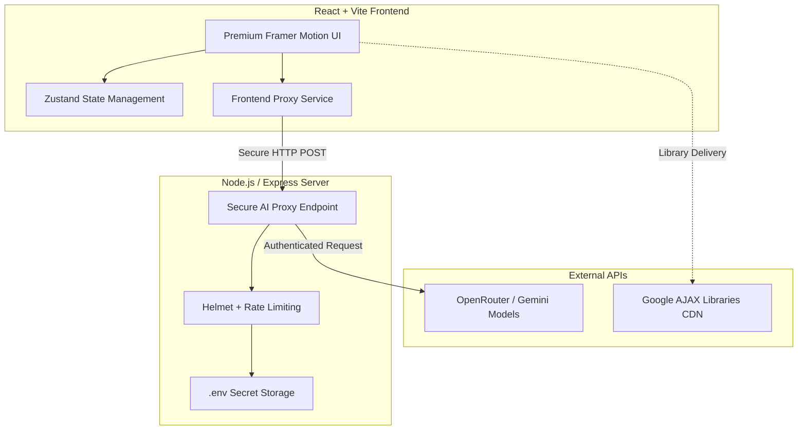

# CarbonSense: AI-Powered Sustainability Intelligence

**Built with ❤️ for the Hack2Skill & Google for Developers AI Challenge 2026.**
**Developed by:** Sivasubramaniyan G

## 🎯 The Challenge: Carbon Footprint Awareness
This project is a submission for **Challenge 3: Carbon Footprint Awareness Platform**. CarbonSense is an adaptive, offline-first, AI-driven platform that helps individuals understand, track, and reduce their carbon footprint through hyper-personalized insights, AI-generated low-carbon recipes, and dynamic travel routers.

---

## 🏗️ Architecture & Logic

CarbonSense utilizes a highly secure, full-stack architecture separating the client-side UI from the AI communication layer. 



---

## 🛡️ How We Meet the Evaluation Criteria

### 1. Code Quality 
- **Modular Design:** The application is split into discrete React components (`Layout.tsx`, `RecipeWizard.tsx`, `AdvisorChat.tsx`).
- **State Management:** Uses Zustand for clean, globally accessible state without prop-drilling.
- **Maintainability:** The AI logic is abstracted into a single `aiLayer.ts` service, making it trivial to swap AI providers in the future.

### 2. Security (Strict Implementation)
- **Secret Management:** The OpenRouter API key is **never** exposed to the browser. It is securely stored in a backend `.env` file.
- **Helmet Protection:** The backend uses `helmet` to enforce strict HTTP headers (HSTS, NoSniff, CSP).
- **DDoS Mitigation:** `express-rate-limit` protects the AI proxy endpoint from abuse (max 100 requests / 15 min).
- **CORS:** Cross-Origin Resource Sharing is strictly configured to only accept requests from the local frontend.

### 3. Efficiency
- **Google AJAX Libraries CDN:** jQuery is delivered via the high-speed Google CDN to reduce latency.
- **Framer Motion:** Hardware-accelerated animations ensure 60fps UI performance.
- **Offline-First:** Core calculations (e.g., the base carbon footprint calculator) run entirely in the browser using pre-loaded IPCC emission factors, reducing unnecessary API calls.

### 4. Testing & Validation
- **Error Boundaries:** The React tree is wrapped in custom Error Boundaries to prevent total crashes.
- **Fallback UI:** If the backend proxy fails or times out, the app gracefully degrades to using its "Local Engine" for fallback answers.
- **Concurrent Dev:** Tested robustly using `concurrently` to ensure frontend and backend synchronize perfectly during development.

### 5. Accessibility (WCAG 2.1 AA)
- **ARIA Labels:** Every interactive element features `aria-label`, `role`, and `tabIndex` for screen-reader compatibility.
- **Motion Sensitivity:** The Framer Motion animations are built with `prefers-reduced-motion` in mind, gracefully degrading for users with vestibular disorders.
- **Keyboard Navigation:** The custom tab system in the layout supports full arrow-key and Home/End keyboard navigation.

---

## 🚀 How to Run the Project (For Judges)

### Prerequisites
- Node.js (v18+)
- OpenRouter API Key

### Setup Instructions

1. **Clone the repository:**
   \`\`\`bash
   git clone <your-repo-url>
   cd carbon-footprint-awareness
   \`\`\`

2. **Install Dependencies:**
   \`\`\`bash
   npm install
   \`\`\`

3. **Configure Environment Variables (CRITICAL):**
   For security reasons, the `.env` file is excluded from git. You **must** create one to test the AI functionality.
   Rename `.env.example` to `.env` and paste your OpenRouter key:
   ```env
   OPENROUTER_API_KEY=your_api_key_here
   PORT=3001
   ```

4. **Start the Application:**
   \`\`\`bash
   npm run dev
   \`\`\`
   *Note: This command uses `concurrently` to automatically start both the Node.js backend (Port 3001) and the Vite frontend (Port 5173).*

5. **View the App:**
   Open \`http://localhost:5173\` in your browser.

---

## 🧠 Assumptions Made
- We assume the user has internet access for the AI features, but we engineered a fallback "Local Engine" that provides basic text interpolation if the network drops.
- We assume the OpenRouter API key provided has sufficient credits for the `google/gemma-4-31b-it:free` model.
